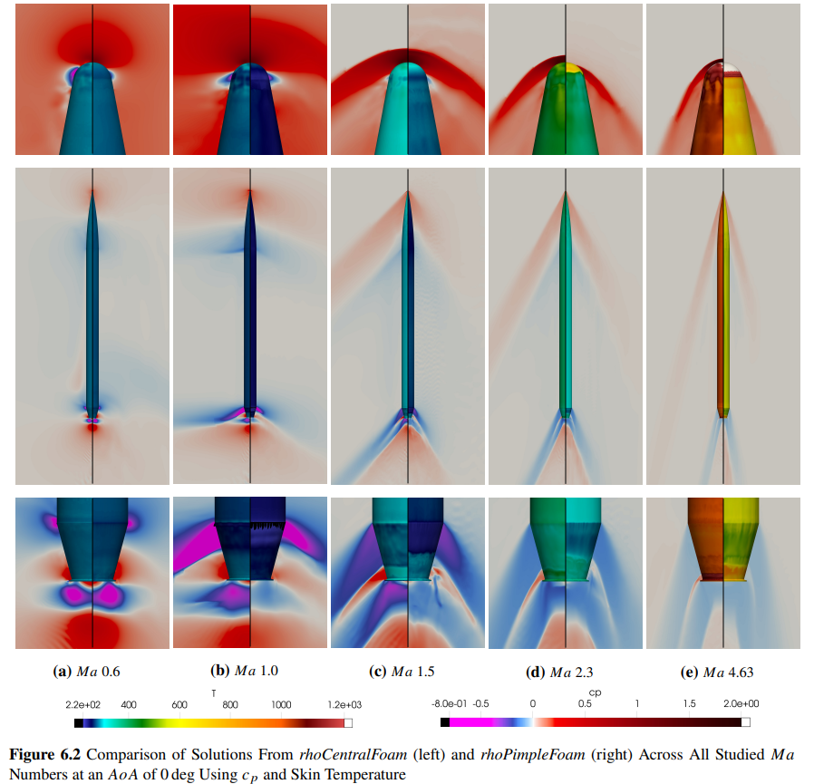
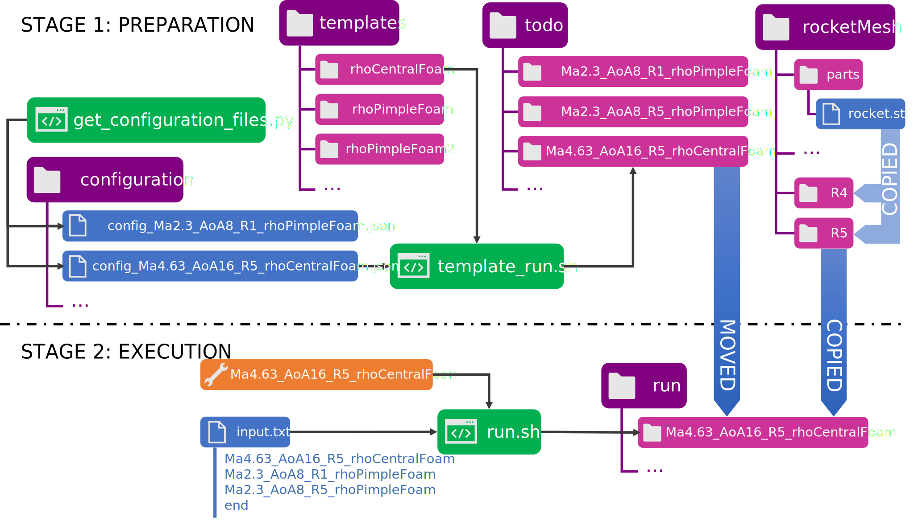
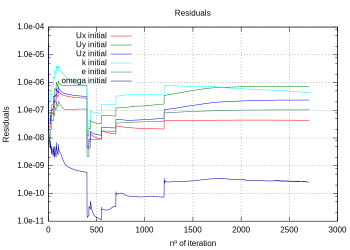
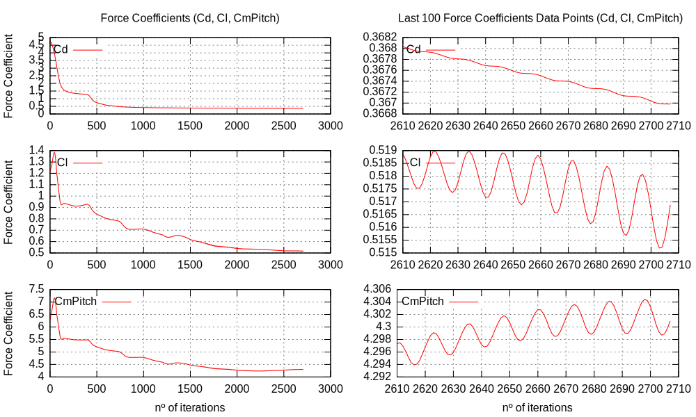

# Automatized & Modular OpenFOAM Workspace to Generate Large Aerodynamic Databases for Subsonic and Supersonic Vehicles 
__by Félix Martí Valverde__

This project provides a complete toolchain for evaluating different rocket geometries at subsonic, transonic, and supersonic regimes. The work contained in this repository is part of a student project carried out at the _Technical University of Munich_ (TUM) under the _Master of Science (M.Sc) in Aerospace_ (year 2023) which aims to provide a standalone and verified methodology to extract aerodynamic characteristics of a rocket using 3D CFD simulation with pressure and density based solvers found in OpenFOAM (ESI group distribution). 



## HIGHLIGHTS

<ul>
  <li>🚀Generation of specific OpenFOAM workspace using templates and <i>JSON</i> configuration files. Powered by <i>Jinja2</i>, a Python module.🚀</li>

  <li>📂Structured Layout for automatic generation of large aerodynamic databases.📂</li>

  <li>🤖Automatic generation of CFD reports with the generation of predefined images through Paraviews Python API.🤖</li>

  <li>⚙️Planned execution in series of multiple OpenFOAM simultations⚙️</li>

  <li>🐋Use of containers to speed up deployment of a CFD server🐳 (5%⬇️ drop in efficiency)</li>

  <li>🤓Examples of OpenFOAM workspaces using <i>rhoPimpleFOAM</i> and <i>rhoCentralFoam</i> at subsonic, transonic, and supersonic regimes.🤓</li>
</ul>

## INTRODUCTION

Computational Fluid Dynamics (CFD) tools from providers like ANSYS (Fluent) or Siemens (Star-CCM+) can be a financial burden on small businesses and startups alike. Thus, open-source alternatives like OpenFOAM are becoming increasingly appealing to reduce development costs. However, OpenFOAM has largely remained a research tool reserved for academia due to its lack of documentation, the high level of expertise required, and a lack of standardization and Graphical User Interface (GUI). This project identifies these shortcomings and aims to streamline the process, which is generally reserved for academia, thus easing the commercial adoption of this tool. 

The entirety of the code has been publicly released in this repository to promote investigation using open-source and free tools. The results obtained during the development phase have been validated against wind tunnel data. The validation methodology can be found in the report "_Toolchain for Aerodynamic Characterization of a Rocket During Ascent using OpenFOAM_" along with the results obtained. Additionally, a set of simulation files for OpenFOAM (ESI group distribution) are also provided below to give a complete overview of the parameters used. 

### links

SIMULATIONS FILES: https://1drv.ms/f/s!AhNN3_xNz6xdhe1IEGJ-niuFxb3V3g?e=uLhchQ

REPORT: https://1drv.ms/b/s!AhNN3_xNz6xdhex7se7BjiaeyGrojg?e=m3ClFa

CAD FILES: https://1drv.ms/f/s!AhNN3_xNz6xdhK0CDDJZs5zly81P_w?e=NSELu2

## SETUP

To set up the workspace download OpenFOAM ESI (www.openfoam.com) and the following additional tools which are necessary to run the full toolchain. Note that _SALOME_ is used to generate the surface of the vehicle from an initial _STEP_ file into an _STL_ file. More information on the procedure can be found in the report, and an example of the _SALOME_ file can be found in the _CAD FILES_ folder link above (file extension .hdf). 

<ul>
  <li>Paraview</li>
  <li>GNUPLOT</li>
  <li>Python 3</li>
  <li>SALOME</li>
  <li>GitHub</li>  
</ul>

Necessary Python modules for the execution of the pipeline are _jinja2-cli_ which can be installed using:

```python3 -m pip install jinja2-cli```

__OPTIONAL__

Other additional Python modules need to be installed to test solvers using structured meshes. In the folder _sphereMesh_ a Python file named _sphere.py_ using python module _classyblocks_ (https://github.com/damogranlabs/classy_blocks) generates a structured mesh around a sphere.

```python3 -m pip install classy-blocks```

Additional tools that may interest the user to interact with the server and write the code are: 
<ul>
  <li>MobaXterm</li>
  <li>Visual Studio Code (VSC)</li>
  <li>XLaunch</li>
</ul>

Also, the project explores different alternatives to execute OpenFOAM on personal computers that might run Windows exclusively. In the report, performance analysis reveals drops in performance due to the use of containers (with Docker) or the Windows Subsystem for Linux (WSL).

## CONTENT

The repository contains 3 fundamental folders: _rocketMesh_, _templates_, and _postProcessingTools_

<ul>
  <li><b>rocketMesh</b>: This folder contains a set of meshes of increasing resolution named R1 to R6. The user can choose from them to compute the solution.</li>
  <li><b>templates</b>: This folder contains templates of OpenFOAM workspace which use different _solvers_ (e.g.<i>rhoPimpleFoam</i>, <i>rhoSimpleFoam</i>, ...) and tune other parameters. The user must provide additional parameters using a <i>JSON</i> file to generate a complete OpenFOAM workspace.</li>
  
  <li><b>postProcessingTools</b>: Set of tools to generate: 
    <ul>
      <li>Real-time monitoring plots for residuals and aerodynamic coefficients.</li>
      <li>Autogenerated reports on single simulations containing images and stats (nº of iterations, CPU time, final aerodynamic coefficients, ...).</li>
      <li>Autogenerated Excel table (<i>CSV</i> files) with multiple simulations, same data as reports.</li>
    </ul>
  </li>
</ul>

Additional folders contained in the repository are extra resources that might come in handy. The submodule folder _OpenFOAM-ToolChain-helperFunctions_ (https://github.com/WyllDuck/OpenFOAM-ToolChain-helperFunctions) contains all the Python scripts used to calculate atmospheric conditions for each simulated case and extract the wind tunnel data to compare CFD results to. 

## EXECUTION

What follows is a diagram found in the report (see link to file above) that shows how to feed a configuration file (_JSON_ file) to a template to obtain a configured OpenFOAM simulation workspace. In the second stage, the diagram explains how to automatically execute the list of OpenFOAM workspaces by providing an ordering list and the workspaces.  

> [!IMPORTANT]  
> The __run__ folder is automatically generated as the storage location if non-existent when the automatic execution of simulation starts. On the same note, the __todo__ folder is automatically generated if non-existent when OpenFOAM workspaces are created as their storage location.

> [!IMPORTANT]
> Also, the configuration files used to template the OpenFOAM workspace are generated using a Python script. This script can be found in the submodule folder _OpenFOAM-ToolChain-helperFunctions_ (https://github.com/WyllDuck/OpenFOAM-ToolChain-helperFunctions), please visit that repository for further information. 



> [!NOTE]
> For an easy and reliable setup of OpenFOAM in any local machine it is recommended to use 🐋Docker. For more information on how to use docker in combination with OpenFOAM go to https://github.com/jakobhaervig/openfoam-dockerfiles. The recommended docker file containing extra modules required to run this particular toolchain can be in the repository's main folder.  

### EXAMPLE

To execute a single example CFD simulation using the toolchain in this repository follow these instructions:

1. Create the specific OpenFOAM file using the templating software. Note that, you <b>must</b> navigate to the <b>templates</b> folder and generate the <b>todo</b> folder, or any other save location for the generated OpenFOAM workspaces.

```bash
cd templates
mkdir -p ../todo
./template_run.sh config.json rhoCentralFoam ../todo/rhoCentralFoamExample
```

The <b>template_run.sh</b> takes 3 parameters. First the *global address* to the <i>JSON</i> configuration file, then the *global address* to the template file (all templating options should be stored in the <i>templates</i> folder), and finally the *global address* where the generated OpenFOAM workspace will be stored. 

> [!IMPORTANT]
> Modify the following parameters in the _JSON_ configuration file to tailor the OpenFOAM workspace to your specific machine and paths. 

2. Go to the _rocketMesh_ folder to generate the mesh that you will be using in this simulation.

```bash
cd ../rocketMesh/rocketShort/noFinSupport/R1
./Allclean
./Allrun
```

It is recommended to first clean the workspace to make sure that no residual files remain in the project.

3. Navigate to the main folder and run the OpenFOAM workspace generated in 1. and stored in the <i>todo</i> folder.

```bash
cd ../../../..
./run.sh input.txt rhoCentralFoamExample
```

The _run.sh_ script takes 2 arguments. A list setting the order of execution of the simulations and the first element on the list that you want to execute. 

__OPTIONAL - MONITORING PLOTS__

4. Monitoring residuals and aerodynamic coefficients of the CFD simulation being executed. You must use a new terminal since the previous terminal is occupied computing the CFD solutions.

```bash
cd postProcessingTools
./plot_forceCoeffs.sh ../run/rhoCentralFoamExample/postProcessing/forceCoeffs1/0/coefficient.dat

./plot_residuals.sh ../run/rhoCentralFoamExample/postProcessing/solverInfo1/0/solverInfo.dat
```

<p float="left">
  
  
</p>

__OPTIONAL - AFTER COMPUTATIONS DONE__

6. Generated a report and predefined images for all simulations located in the _run_ folder, and _CSV_ file containing all relevant metrics of all simulations in the _run_ folder. Note that in the current example only one simulation, _rhoCentralFoamExample_ should be in the _run_ folder. 

```bash
python3 genAllTable.py run #FOLDER1 FOLDER2 FOLDER3 ...
```

The Python script takes as arguments a list of path directories containing OpenFOAM workspaces, in this example, the OpenFOAM workspace _rhoCentralFoamExample_ is stored in the _run_ folder and no other location contains more OpenFOAM workspaces.

> [!IMPORTANT]
> This command will only generate images if the Python instruction _"from paraview.simple import *"_ if successfull. This requires a correct installation of Paraview which might be difficult depending on the user's knowledge. A solution is proposed in document _postProcessingTools/automaticImg/VTKtoIMAGE.py_.

### HOW TO ADD CONFIGURABLE PARAMETERS TO THE TEMPLATES

Navigate to the example configuration _JSON_ file located in the main folder. This file must contain all the parameters that the selected template requires. Following the example previously presented you can visit the template _rhoCentralFoam_ and look for files with the extension _.j2_. This extension tells the _template_run.sh_ script that that file contains configurable parameters that must be written using Jinja2. Some of these parameters can be directly copied from the _JSON_ file, while others use Jinja2 logic (for loops, if conditions, etc.) which can be found in https://jinja.palletsprojects.com/en/2.10.x/

To add configurable parameters to a template follow these steps

1. Change the extension of the file to _.j2_. It is recommended to issue git commands when changing the file's name to keep track of past changes.

```bash
git mv file1 file1.j2
```

2. Add Jinja2 syntax (https://jinja.palletsprojects.com/en/2.10.x/) to template the file
3. Add the new parameters to your _JSON_ configuration file. 

